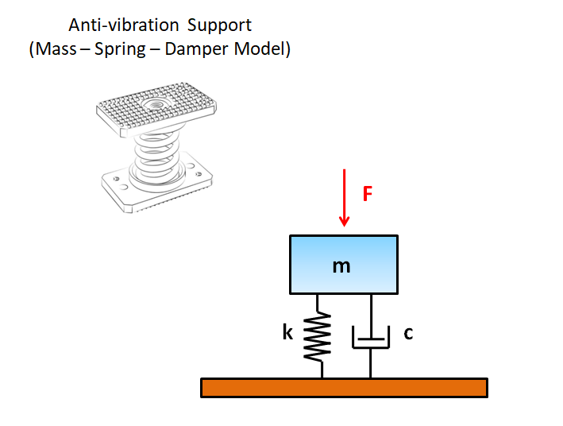
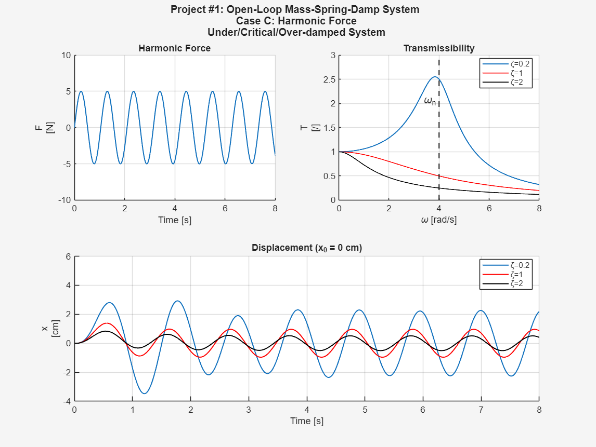

# 1DOF Mass-Spring-Damper Anti-vibration Support
Dynamic simulation and analysis of a 1DOF open-loop mass–spring–damper system representing an anti-vibration support for **educational purposes**.

## Overview
Simulation and analysis of a 1-DOF open-loop mass–spring–damper system representing an **anti-vibration support**.
The dynamic response is studied using **MATLAB** and **Simulink** under free vibration, step force, and harmonic excitation.

## Physical Model
The system consists of a rigid mass supported by a vertical anti-vibration element modeled with **linear stiffness** and **viscous damping**.
The support is mounted vertically and works mainly in compression.
The motion is described along the vertical direction with respect to the static equilibrium position.

**Figure 1 – 1-DOF Mass–Spring–Damper Model**

## System Parameters
- Mass: **10 kg**
- Stiffness: **160 N/m**
- Damping ratios:
  - **ζ = 0.2** (under-damped)
  - **ζ = 1.0** (critically damped)
  - **ζ = 2.0** (over-damped)

> **Note:** These values are **simplified for demonstration purposes**.
> > Real anti-vibration supports in industrial applications handle **much larger masses (50–1000 kg)** and have **stiffness values in the order of 10⁴–10⁶ N/m**.  
> Damping ratios used here are for illustrative purposes; actual industrial supports usually have ζ ≈ 0.05–0.3.

## Governing Equation
The system dynamics are governed by the following second-order differential equation:

**m * x_ddot(t) + c * x_dot(t) + k * x(t) = F(t)**

where:
- **m** — mass of the supported object [kg]
- **c** — damping coefficient of the anti-vibration support [Ns/m] calculated as
  - **c = 2·ζ·m·ωₙ** (natural frequency **ωₙ = sqrt(k / m)**)
- **k** — vertical stiffness of the support [N/m]
- **x(t)** — vertical displacement [m]
- **F(t)** — external excitation force [N]

The equation describes the vibration of the mass around its static equilibrium position.  
Gravity effects are included via the static preload and are not explicitly represented in the dynamic equation.

## Excitation Cases and Parameters
### Free Response
- Initial displacement: 0.1 m
- Initial velocity: 0 m/s
- External force F(t): 0 N
 
### Step Excitation
**F(t) = F₀ · u(t)**

- Magnitude F₀: 5 N
- Step applied at t = 1 s
- Duration: full simulation
- Initial displacement: 0 m
- Initial velocity: 0 m/s

### Harmonic Force 
**F(t) = F₀ · sin(ωt)**

- Amplitude: 5 N
- Angular frequency: 1.5·ωₙ [rad/s]
- Initial displacement: 0 m
- Initial velocity: 0 m/s

#### Resonance and Transmissibility Analysis
Resonance analysis has been performed for **educational purposes**. 
- Under-damped system (ζ = 0.2) shows amplitude peaks near the natural frequency (~3.98 rad/s)
- Higher damping ratios reduce the peak, illustrating the effect of damping on system response
  
**Reminder**: real industrial systems would have much higher mass and stiffness, resulting in higher natural frequencies and different resonance behavior.

## Tools Used
- MATLAB (post-processing)
- Simulink (dynamic system modeling)

## Repository Structure
### /matlab
- free_vibration.m
- step_excitation.m
- harmonic_excitation.m
### /simulink
- MKC_open_loop.slx
### /figures
- free_response.png
- step_response.png
- harmonic_response.png
- Open_Loop_MKC_System.png

## Results Preview

