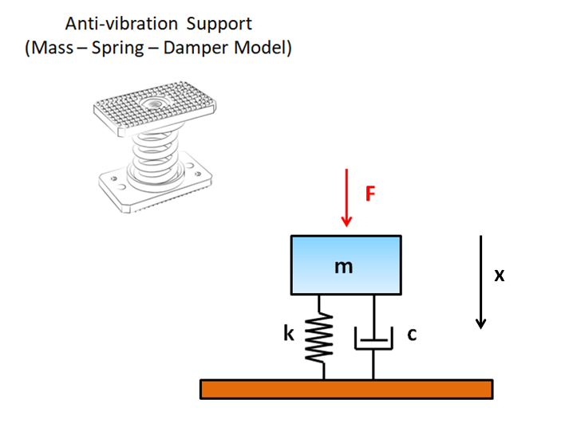
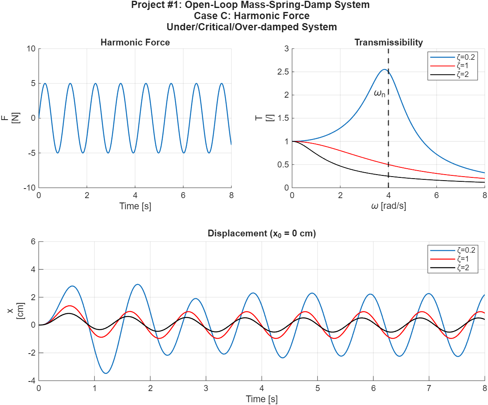

# 1DOF Mass-Spring-Damper Anti-vibration Support
Dynamic simulation and analysis of a 1DOF open-loop mass–spring–damper system representing an anti-vibration support for **educational purposes**.

## Project Overview
Simulation and analysis of a 1-DOF open-loop mass–spring–damper system representing an **anti-vibration support**.
The dynamic response is studied using **MATLAB** and **Simulink** under free vibration, step force, and harmonic excitation.

## System Model
The system consists of a rigid mass supported by a vertical anti-vibration element modeled with **linear stiffness** and **viscous damping**.
The support is mounted vertically and works mainly in compression.
The motion is described along the vertical direction with respect to the static equilibrium position.

**Figure 1 – 1-DOF Mass–Spring–Damper Model**

## System Parameters
- Mass: **10 kg**
- Stiffness: **160 N/m**
- Damping ratios:
  - **ζ = 0.2** (under-damped)
  - **ζ = 1.0** (critically damped)
  - **ζ = 2.0** (over-damped)

> **Note:** These values are **simplified for demonstration purposes**.
> > Real anti-vibration supports in industrial applications handle **much larger masses (50–1000 kg)** and have **stiffness values in the order of 10⁴–10⁶ N/m**.  
> Damping ratios used here are for illustrative purposes; actual industrial supports usually have ζ ≈ 0.05–0.3.

## Governing Equation
The system dynamics are governed by the following second-order differential equation:

$$
m\frac{d^2x(t)}{dt^2} + c\frac{dx(t)}{dt} + kx(t) = F(t)
$$

where:
- **m** — mass of the supported object [kg]
- **c** — damping coefficient of the anti-vibration support [Ns/m] calculated as
  - **$$c = 2 ζ m \omega_n$$** (natural frequency **$\omega_n=$** **$\sqrt\frac{k}{m}$**)
- **k** — vertical stiffness of the support [N/m]
- **x(t)** — vertical displacement [m]
- **F(t)** — external excitation force [N]

The equation describes the vibration of the mass around its static equilibrium position.  
Gravity effects are included via the static preload and are not explicitly represented in the dynamic equation.

## Simulation Cases
### Free Response
- Initial displacement: 0.1 m
- Initial velocity: 0 m/s
- External force F(t): 0 N
 
### Step Excitation
**F(t) = F₀ · u(t)**

- Magnitude F₀: 5 N
- Step applied at t = 1 s
- Duration: full simulation
- Initial displacement: 0 m
- Initial velocity: 0 m/s

### Harmonic Force 
**F(t) = F₀ · sin(ωt)**

- Amplitude: 5 N
- Angular frequency: 1.5·ωₙ [rad/s]
- Initial displacement: 0 m
- Initial velocity: 0 m/s

#### Resonance and Transmissibility Analysis
Resonance analysis has been performed for **educational purposes**. 
- Under-damped system (ζ = 0.2) shows amplitude peaks near the natural frequency (~3.98 rad/s)
- Higher damping ratios reduce the peak, illustrating the effect of damping on system response
  
**Reminder**: real industrial systems would have much higher mass and stiffness, resulting in higher natural frequencies and different resonance behavior.

---

## Results

Simulation results show:
- Displacement, velocity and acceleration over time
- Excitation forces
- Comparison between under-critically-over dumped systems

Graphs and screenshots are stored in the `figures/` folder.

**Figure 1 – Harmonic response**

---
## Observations from Simulations
From the simulations, we can deduce:

- **Free vibration**: The system oscillates at its natural frequency, with the amplitude gradually decreasing according to the damping coefficient.
- **Step excitation**: The rise time, overshoot, and settling time depend on the damping and stiffness. Higher damping reduces overshoot and accelerates stabilization.
- **Harmonic excitation**: The system shows frequency-dependent amplitude; resonance effects are visible if the excitation frequency is close to the natural frequency.
- **Effect of damping**: Increasing the damping coefficient reduces overshoot and oscillations, improving stability.

These observations confirm that the mass-spring-damper system behaves as expected under different excitations and damping conditions.

---

## Tools Used
- MATLAB (post-processing)
- Simulink (dynamic system modeling)

---

## Possible Improvements

- Implement active damping or feedback control to reduce overshoot further.
- Test the system with different mass, spring, and damping values to study sensitivity.
- Add nonlinearities (e.g., friction, variable damping) to make the model more realistic.
- Perform frequency response analysis for harmonic excitation.
- Conduct hardware experiments to validate the simulation results.

---

## Repository Structure

The repository contains:

| Folder       | Contents                                 |
| ------------ | --------------------------------------- |
| matlab/      | MATLAB scripts |
| simulink/    | Simulink model |
| figures/     | Simulation plots and system diagram |

---

## Results Preview

